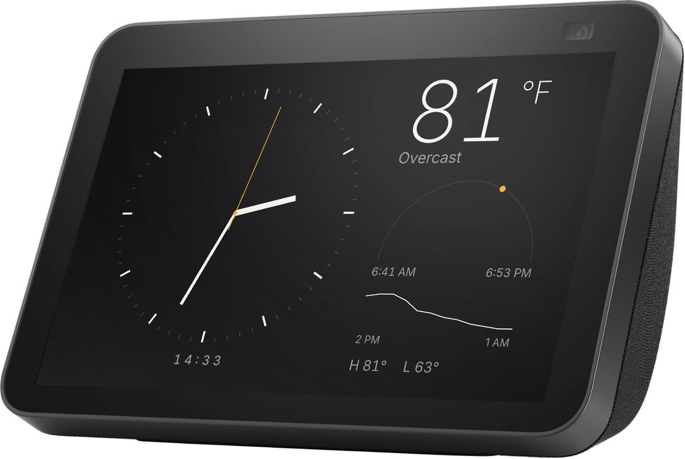

# ShowRunner

Self-hosted dashboard kiosk for a rooted Amazon Echo Show 8 running LineageOS. A thin Android
app shows one full-screen WebView; a Next.js server on your LAN decides what every screen shows,
so you design screens in a browser and never touch the device again.

Built for one household: a single admin user, a single shared device secret, and a LAN with no
inbound exposure. Only the Echo Show 8 (2nd gen, LineageOS 18.1 / Android 11) is tested.



*A screen generated from a text description in the dashboard, running on the device.*

## How it works

The device registers with the server, loads `/device/<id>`, and obeys server-sent events
(`reload`, `navigate`, `refreshData`). A **screen** is an HTML/CSS/JS template stored in the
database; the server renders it and injects a small runtime that exposes live data as
`window.kiosk.data` and fills `data-bind` attributes. **Playlists** rotate screens on a dwell
timer. **Providers** (time, weather via Open-Meteo) supply the data. Details, diagram and
request flow: [docs/architecture.md](docs/architecture.md).

## Features

- Pairing by on-screen code; claim, name and assign devices from the dashboard.
- Launcher kiosk mode by default; optional strict mode (device owner + lock task) that can always
  be left from the on-device exit menu or the dashboard, never by factory reset.
- Screen editor with a live 1280×800 preview and three built-in screens (clock, clock + weather, and
  the analog dial pictured above).
- AI screen generation from a description through any OpenAI-compatible API (optional).
- Playlists, per-device commands, device logs and heartbeat status in the dashboard.

## Quick start

You need Docker on a machine on the same LAN as the display, and adb for the one-time device
install.

1. **Configure the server.**

   ```sh
   git clone https://github.com/notglossy/show-runner.git && cd show-runner
   cp .env.example .env
   # edit .env: set ADMIN_PASSWORD and DEVICE_SHARED_SECRET (openssl rand -hex 32)
   ```

2. **Run it.**

   ```sh
   docker compose up --build -d
   ```

   Open `http://<server-lan-ip>:3000`, log in with `ADMIN_PASSWORD`. Health check:
   `/api/health`. The SQLite database lives on the `showrunner-data` volume.

3. **Prepare the display** once, following [docs/device-setup.md](docs/device-setup.md):
   enable adb, then build and install the app with the server address and secret:

   ```sh
   scripts/install.sh --server http://<server-lan-ip>:3000 --secret "$DEVICE_SHARED_SECRET" --home
   ```

   The display shows a pairing code. In the dashboard, open **Devices**, claim the code and give
   the device a name. It starts on the built-in clock screen.

4. **Make screens.** Edit the built-in screens or write new ones in the editor. The template
   contract is [docs/screen-authoring.md](docs/screen-authoring.md). Set `AI_API_KEY` to
   generate screens from a description.

## Configuration

Everything is environment variables, read by `docker compose` from `.env`.

| Variable | Required | Default | Purpose |
|---|---|---|---|
| `ADMIN_PASSWORD` | yes | | Dashboard login, also accepted as `Authorization: Bearer` for scripting |
| `DEVICE_SHARED_SECRET` | yes | | Sent by the app when registering a device |
| `WEATHER_LAT`, `WEATHER_LON` | | Los Angeles | Weather location (overridable in dashboard settings) |
| `WEATHER_UNITS` | | `imperial` | `imperial` or `metric` |
| `KIOSK_TIMEZONE` | | `America/Los_Angeles` | IANA timezone for time on screens |
| `AI_BASE_URL` | | OpenRouter | OpenAI-compatible Chat Completions endpoint |
| `AI_API_KEY` | | | Enables AI screen generation |
| `AI_MODEL` | | `google/gemini-3.8-flash` | Default model; the editor can pick another |
| `SHOWRUNNER_PORT` | | `3000` | Host port |
| `DATABASE_PATH` | | `/data/showrunner.db` | SQLite file (inside the container) |

## Development

Server: Node 22 and pnpm 10 (`corepack enable`).

```sh
pnpm install
pnpm dev      # http://localhost:3000
pnpm check    # format, lint, typecheck, tests with coverage, build
```

Android: open `apps/android` in Android Studio, or from the shell with its bundled JDK:

```sh
cd apps/android
./gradlew assembleDebug          # APK
./gradlew testDebugUnitTest      # JVM unit tests, no device needed
```

Every pull request runs the same checks plus an AI review. See
[CONTRIBUTING.md](CONTRIBUTING.md) for conventions.

## Documentation

- [Architecture](docs/architecture.md): components, request and event flow, key decisions.
- [Device setup](docs/device-setup.md): every adb step, kiosk modes, release signing, troubleshooting.
- [HTTP API](docs/api.md): authentication, device and admin endpoints, error shape.
- [Screen authoring](docs/screen-authoring.md): the template contract and the data available to screens.
- [Glossary](docs/glossary.md).
- [Security policy](SECURITY.md): threat model and how to report.

## License

MIT, see [LICENSE](LICENSE). Bundled fonts are under the SIL Open Font License; their license
texts ship next to the font files.
