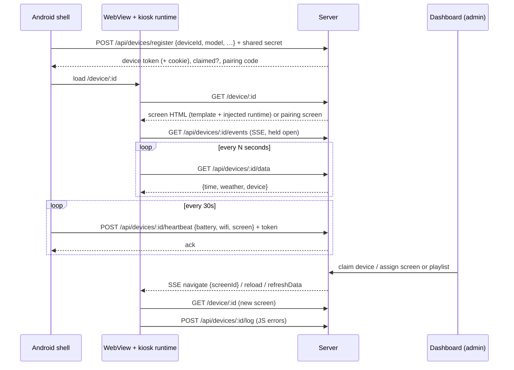

# Architecture

ShowRunner has two moving parts: a **dumb Android WebView shell** on the Echo Show 8 and a
**Next.js server** on the LAN that owns all state and decides what every device shows.

```
┌────────────── Echo Show 8 (Android 11, WebView 139) ──────────────┐
│  MainActivity (launcher kiosk; strict lock task optional)          │
│   ├─ native: register, heartbeat (30s), watchdog, config.json     │
│   ├─ JS bridge `KioskNative`: brightness, reload, device info     │
│   └─ WebView ── loads /device/:id ──┐                             │
│        injected runtime `window.kiosk`                            │
│          ├─ polls  GET  /api/devices/:id/data                     │
│          ├─ listens GET /api/devices/:id/events  (SSE)            │
│          └─ posts  POST /api/devices/:id/log                      │
└───────────────────────────────────────┬───────────────────────────┘
                                        │ HTTP (LAN; TLS via reverse proxy later)
┌──────────────── Docker: Next.js server ────────────────────────────┐
│  /device/:id        renders assigned screen template + runtime     │
│  /api/devices/*     register, heartbeat, data, events, log         │
│  /api/screens, /api/playlists   CRUD (Zod-validated)               │
│  dashboard (/)      admin UI, password auth                        │
│  providers/         time, weather (Open-Meteo), … with cache TTL   │
│  playlist scheduler sends `navigate` over SSE                      │
│  SQLite (Drizzle) on /data volume                                  │
└────────────────────────────────────────────────────────────────────┘
```

## Request / event flow



## Key decisions

- **Server-driven rendering.** A screen is a DB row holding an HTML/CSS/JS template. The device
  never knows about screens or playlists; it just loads `/device/:id` and obeys SSE commands.
- **Playlists rotate on the server.** The server sends `navigate` when a dwell time expires.
- **Data binding.** Templates use `data-bind="weather.temp"` and `kiosk.on('data', fn)`.
  The full contract is in [`screen-authoring.md`](screen-authoring.md) which also serves as
  the system prompt for AI screen generation (Phase 4).
- **Providers.** One file per provider (`fetch()` + TTL) plus one registry entry.
- **Auth.** One admin password (env var): dashboard session cookie, or `Bearer <password>` for
  scripting. Devices send the shared secret **only to register**. Registration returns a
  **per-device token** (rotated on every registration). Native calls such as heartbeat send it as a
  Bearer header. The shell also stores it as a cookie for the server origin via `CookieManager`, so
  every WebView request (page, data, SSE, log) carries it; `EventSource` can't set headers. Details
  are in [`api.md`](api.md).
- **AI screens.** The editor sends a description (plus the current template when revising) to
  `POST /api/ai/generate-screen`, which streams a request to an OpenAI-compatible API with
  `screen-authoring.md` as the system prompt, validates the fragment, and does one repair turn if needed.
- **Config over rebuilds.** Server config is env vars. Device config is
  `/sdcard/showrunner/config.json` or `am start` intent extras.

## Deployment

- Dev: `pnpm dev` on the Mac, or `docker compose up` (native arm64).
- Prod: the home server (amd64) builds the same `apps/server/Dockerfile` via Komodo.
  DB lives on the `showrunner-data` named volume at `/data/showrunner.db`.
