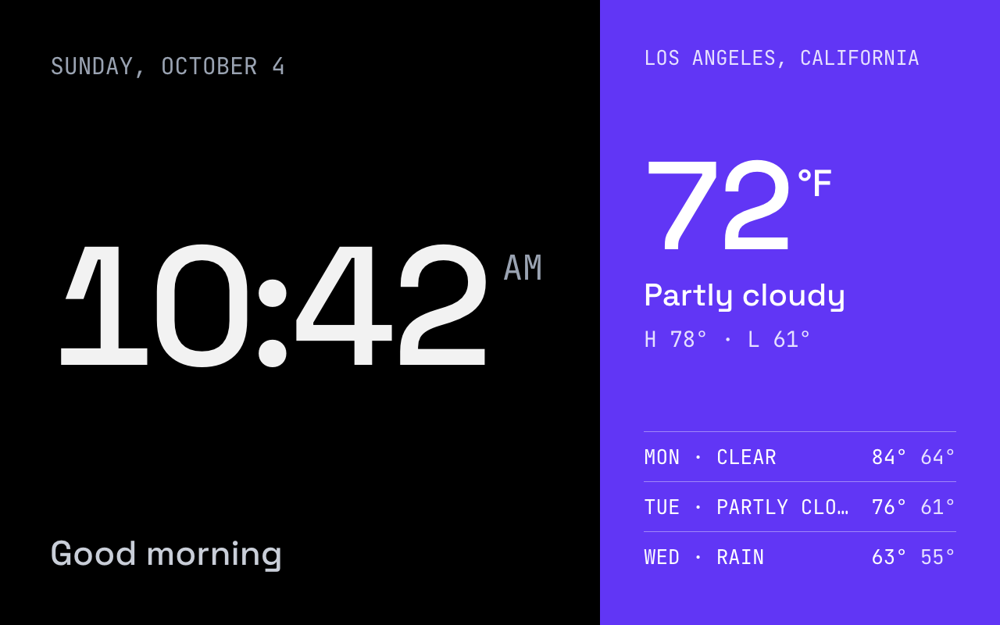
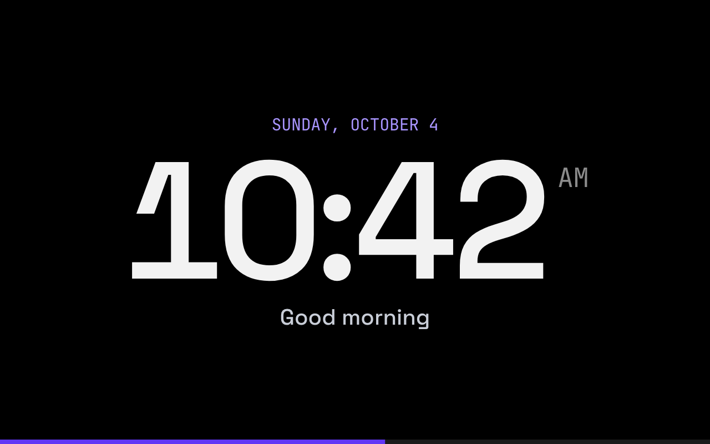
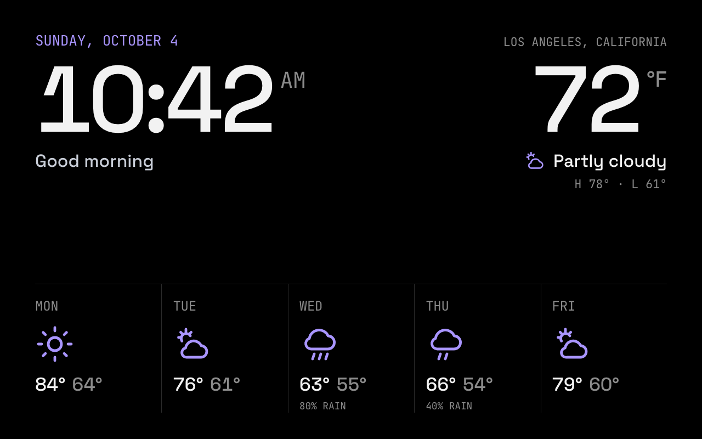
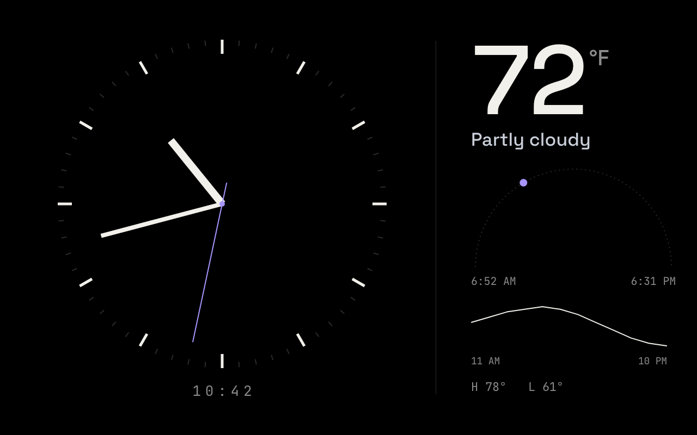
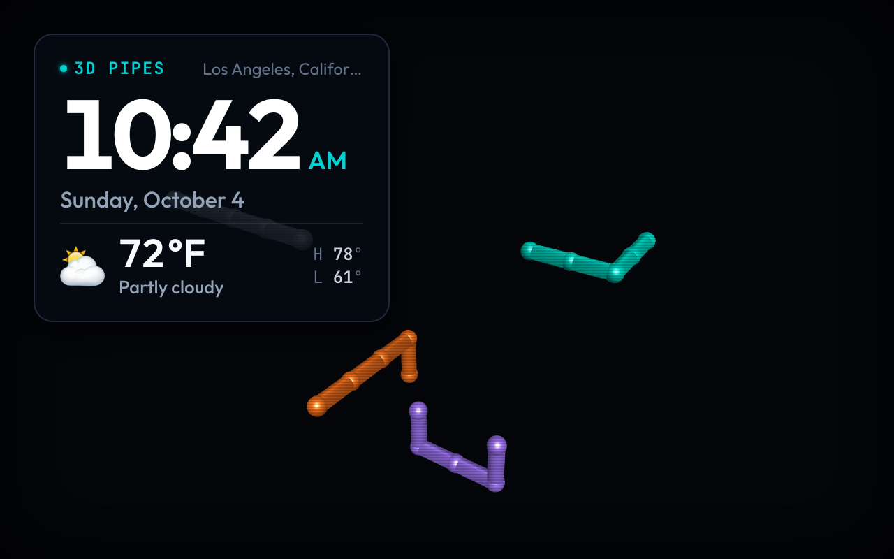
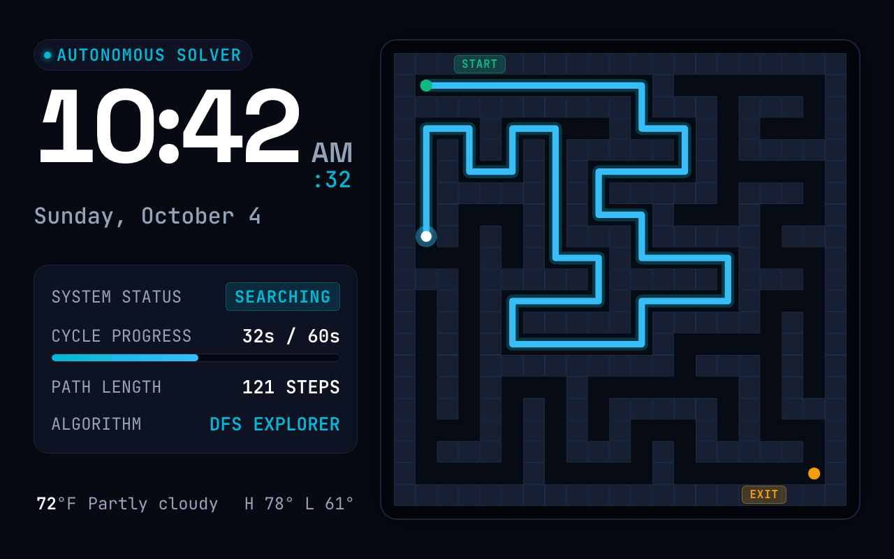

# Example screens

Copy-and-paste screen templates. Each folder has the template (`screen.html`), a 1280×800 screenshot, and a
README covering the data it uses and how to restyle it. Screenshots show Sunday, October 4 at 10:42 AM with
sample weather for Los Angeles.

## Built-in screens

These ship with ShowRunner and are already in your dashboard (they're seeded on first start).

| | Screen | What it shows |
|---|---|---|
|  | [**Default**](default/) | Big clock and greeting on black; today's weather and a 3-day outlook on a violet panel. New displays start here. |
|  | [**Clock**](clock/) | A centered clock with the date and greeting, and a bar that fills over each minute. |
|  | [**Clock & Weather**](clock-weather/) | Time and current temperature side by side, with a 5-day forecast in line icons. |
|  | [**Dial**](dial/) | An analog clock with a sweeping second hand, the sun's position between sunrise and sunset, and the next 12 hours of temperature. |

## More examples

Not built in: add them from the dashboard to use them.

| | Screen | What it shows |
|---|---|---|
|  | [**3D Pipes**](3d-pipes/) | The classic 3D Pipes screensaver in WebGL, with the time and weather in a card. Animates continuously; best in a playlist. |
|  | [**Maze Solver**](maze-solver/) | A new maze every minute, solved live by a depth-first search, with the time, solver telemetry and weather alongside. |

## Using an example

1. In the dashboard, open **Screens → New screen**.
2. Give it a name and paste the contents of `screen.html` into the editor. The preview updates as you type.
3. Set **Data refresh (s)** to the value in the example's README, then **Create screen**.
4. Assign it to a display from **Devices**, or add it to a playlist.

Most templates keep their colors as CSS variables in a block at the top of their `<style>`, so restyling
usually means changing one or two lines; each README says where. The full template contract (data fields,
`data-bind`, the `kiosk` runtime, fonts) is in [docs/screen-authoring.md](../docs/screen-authoring.md).

## Adding an example

Add a folder with three files:

- `screen.html`: the template. It must pass the same checks as AI-generated screens (no external URLs or
  fonts, only documented data fields, no data in `innerHTML`); a test runs them on every example.
- `screenshot.png`: 1280×800, ideally at the moment and with the sample weather above.
- `README.md`: what it shows, its data refresh, the fields it uses, how to restyle it, and anything unusual
  (heavy animation, WebGL, …).

Then add a row to **More examples** above.

## Keeping the built-ins in sync

The built-in templates live in `apps/server/src/lib/seed/screens.ts`; their `screen.html` files here are
generated from them and a test fails if they drift. After changing a built-in screen, run:

```sh
pnpm --filter @showrunner/server examples
```

Screenshots and READMEs are updated by hand.
