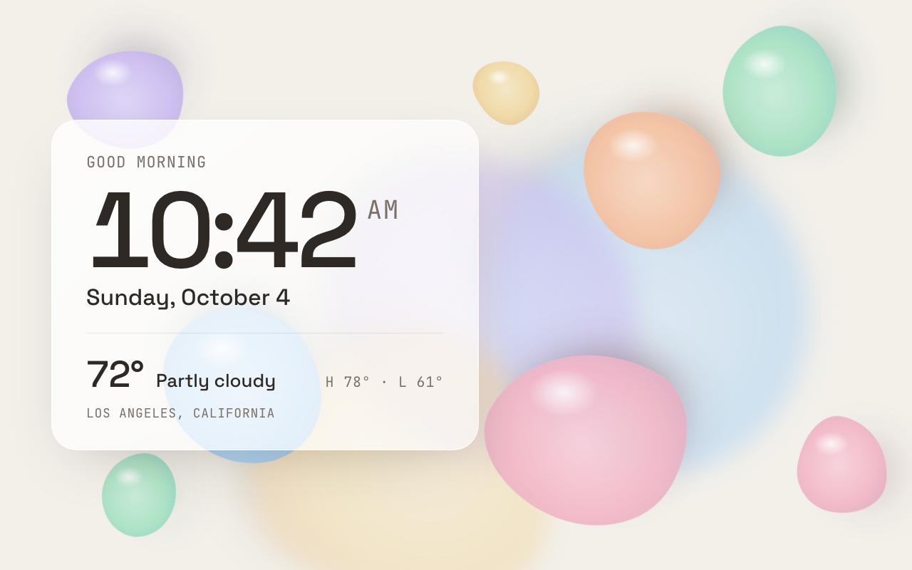

# Bubbles



Soft pastel blobs drift around a warm paper-white screen, slowly turning and changing shape as they go, with
blurred ones further back for depth. A frosted card on the left shows the greeting, time, date, weather and
location. The only light-themed example.

Not a built-in screen: add it from the dashboard to use it.

- **Data refresh:** 60 seconds
- **Template:** [`screen.html`](screen.html)

## Data it uses

| Field | Shown as |
|---|---|
| `time.greeting` | Greeting above the clock |
| `time.hhmm`, `time.ampm`, `time.date` | Clock and date |
| `weather.current.temperature`, `weather.current.condition` | Temperature and conditions |
| `weather.today.high`, `weather.today.low` | High and low |
| `weather.location.name` | Location under the weather (hidden when not set) |

The blobs don't use any data, and the screen has no script.

## Restyling

All colors are variables at the top of the `<style>` block:

```css
:root {
  --bb-bg: #f3f0ea;     /* warm paper background */
  --bb-ink: #2e2925;    /* clock and headings */
  --bb-muted: #7a716a;  /* date, labels */
  --bb-mint: #a8e2c4;
  --bb-sky: #a9d2f5;
  --bb-blush: #f3b8c8;
  --bb-sand: #f0d9a4;
  --bb-lilac: #cdbdf3;
  --bb-peach: #f7c3a1;
}
```

Each blob is one element with its settings as custom properties: start position (`--x`, `--y`), `--size`,
color (`--c`), two waypoints it travels through (`--ax`/`--ay`, `--bx`/`--by`), and the lengths of its
travel loop (`--dur`), rotation (`--spin`) and outline morph (`--morph`). Add, remove or retune blobs by
copying one of those lines. Add `blob--far` to make one blurred and pushed back.

## Notes

- **Pure CSS.** Each blob layers three animations: it travels through its waypoints (60–110 s a lap), rotates
  slowly, and morphs its outline (an animated `border-radius`) while wobbling gently. A fixed highlight on
  top keeps them looking glossy as they turn.
- **Runs smoothly on the Echo Show 8.** The outline morph repaints the blobs every frame (the authoring
  guide prefers transform-only animation). On a slower display, drop the `morph` animation from the three
  `blob--far` blobs first (they're the largest and their blur hides the shape), then use fewer or smaller
  blobs.
- The card's frosted look is a translucent white fill, not `backdrop-filter`, which would re-blur the moving
  blobs every frame.
- A bright light screen stands out in a dark room at night; pair it with a darker screen in a playlist if
  that matters.
- The screenshot shows the scene 28 seconds in.
