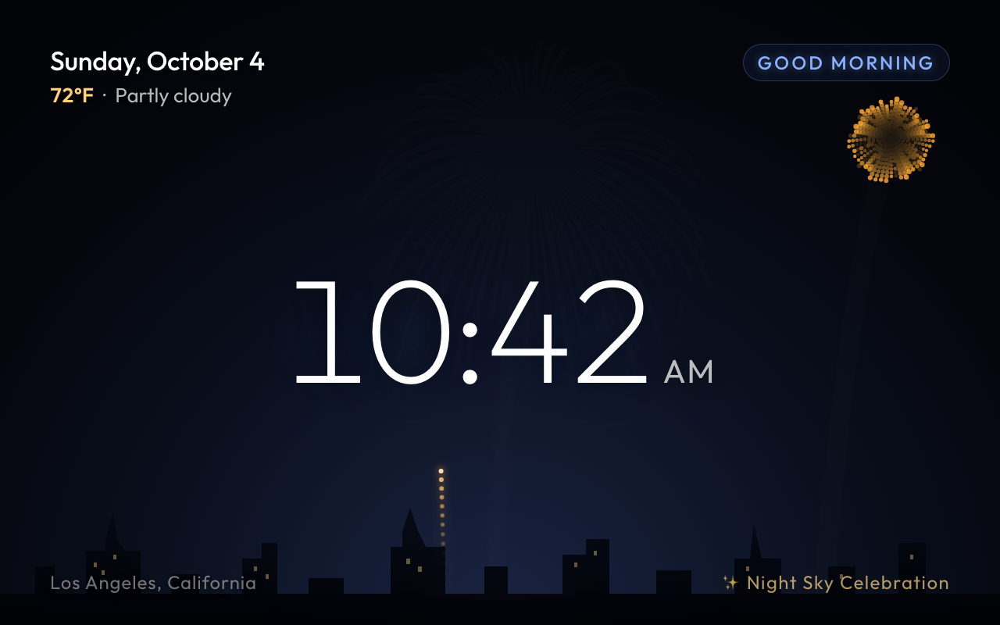

# Fireworks

Fireworks over a city skyline. A rocket launches every couple of seconds (sometimes two at once), climbs and
bursts into a shell, a ring or a double burst in one of seven colors, with sparks that drift down, flicker and
fade. A thin clock sits in the middle, the date and weather top left, a greeting top right, and the location
bottom left.

Not a built-in screen: add it from the dashboard to use it.

- **Data refresh:** 60 seconds
- **Template:** [`screen.html`](screen.html)

## Data it uses

| Field | Shown as |
|---|---|
| `time.date`, `time.hhmm`, `time.ampm` | Date and clock |
| `time.greeting` | Greeting badge, top right |
| `weather.current.temperature`, `weather.units.temperature`, `weather.current.condition` | Weather line under the date |
| `weather.location.name` | Location, bottom left (falls back to "ShowRunner Display") |

The fireworks don't use any data.

## Restyling

- **Text colors:** the `:root` variables at the top of the `<style>` block.
- **Sky:** the `radial-gradient` on `.screen` (it glows from the horizon up).
- **Firework colors:** `COLOR_PALETTES` in the script, as `[hue, saturation %, lightness %]`.
- **Pace:** `nextLaunch` in `loop()` (frames between launches, about 80–150 at 60 fps).
- **Skyline:** the inline SVG path and the window-light rectangles under it.

## Notes

- **Runs smoothly on the Echo Show 8.** It animates on a `requestAnimationFrame` loop and fades the whole
  canvas every frame for the spark trails, livelier than the authoring guide's suggested slow, subtle
  motion.
- The trails fade the canvas toward transparent rather than painting it dark, so the sky gradient and the
  skyline behind it stay visible.
- The screenshot shows the scene 140 frames in (just over 2 seconds at 60 Hz).
