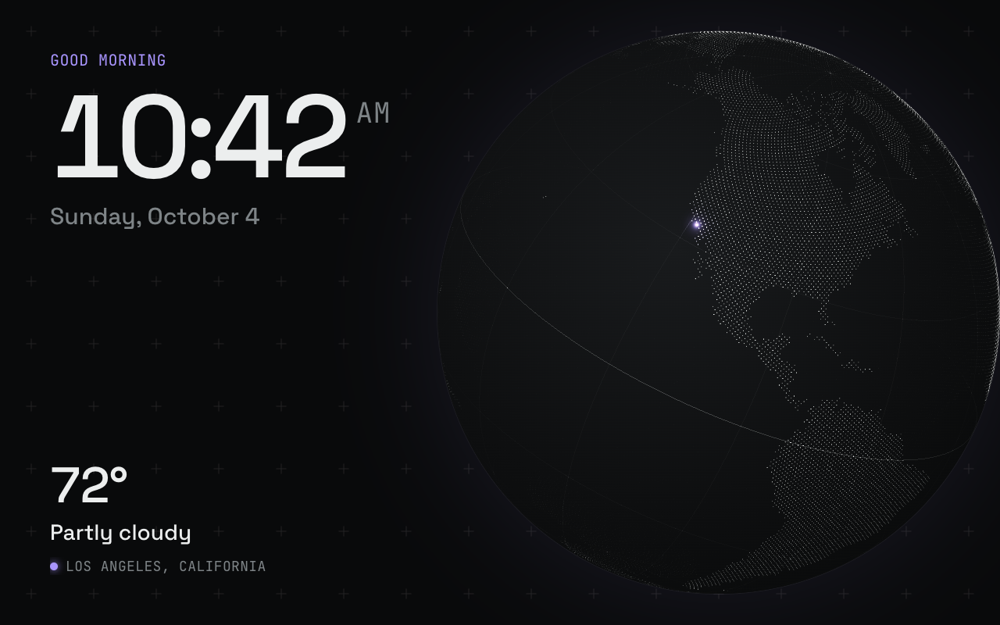

# Globe



A slowly turning Earth, its axis tilted 23.4° like a desk globe, drawn as about 27,000 glowing dots, dense over land and sparse over the oceans, with
faint latitude and longitude lines and a pulsing marker at your weather location. The time and date sit top left, the current weather bottom left.
Inspired by the dot-cloud globes on product sites, drawn from a real 1° land map.

Not a built-in screen: add it from the dashboard to use it.

- **Data refresh:** 60 seconds
- **Template:** [`screen.html`](screen.html)

## Data it uses

| Field | Shown as |
|---|---|
| `time.greeting`, `time.hhmm`, `time.ampm`, `time.date` | Greeting, clock and date |
| `weather.current.temperature`, `weather.current.condition` | Temperature and conditions |
| `weather.location.name` | Location label, bottom left |
| `weather.location.latitude`, `weather.location.longitude` | The marker on the globe (hidden if missing) |

## Restyling

Colors are variables at the top of the `<style>` block:

```css
:root {
  --gb-bg: #090a0b;      /* page */
  --gb-ink: #eceeee;     /* clock */
  --gb-muted: #7e8487;   /* date, labels */
  --gb-accent: #a995ff;  /* label, your-location marker */
}
```

Settings at the top of the script:

| Setting | Default | What it does |
|---|---|---|
| `POINTS` | `75000` | Candidate dots; land ones are kept, most ocean ones dropped (about 27,000 drawn) |
| `OCEAN_KEEP` | `0.05` | Share of ocean dots kept, drawn dimmer |
| `SPIN_DEG_PER_SEC` | `5` | Rotation speed (a full turn every 72 seconds) |
| `AXIS_TILT_DEG` | `23.4` | Sideways lean of the spin axis, Earth's real axial tilt; `0` spins upright |
| `VIEW_TILT_DEG` | `22` | How far the view looks down onto the northern hemisphere |
| `SHOW_FPS` | `false` | Frame rate and dot count, bottom right |
| `GRID_DEG` | `30` | Spacing of the latitude and longitude lines; `0` turns them off |
| `GRID_ALPHA` | `0.35` | Brightness of the lines (the equator is drawn a little brighter) |

## Notes

- **Runs at the Echo Show 8's full refresh rate** (55.9 Hz on its Mali-T720) with no dropped frames, and
  still did with 74,000 dots. The dots are uploaded to the GPU once; each frame only sends the rotation
  angle, so it's light on the CPU. The latitude and longitude lines are drawn the same way.
- **The land map** is a 360 × 180 grid of 1° cells (1 bit each, base64 in the script, about 11 KB),
  rasterized from [Natural Earth](https://www.naturalearthdata.com/)'s 1:110m land polygons (public domain).
- The background's "+" marks (every 80px, like the reseau crosses on NASA photos) are a static inline SVG
  pattern; change their color in the `.gb-marks path` rule.
- Needs WebGL. Without it the canvas stays empty and the dark sphere, time and weather still show.
