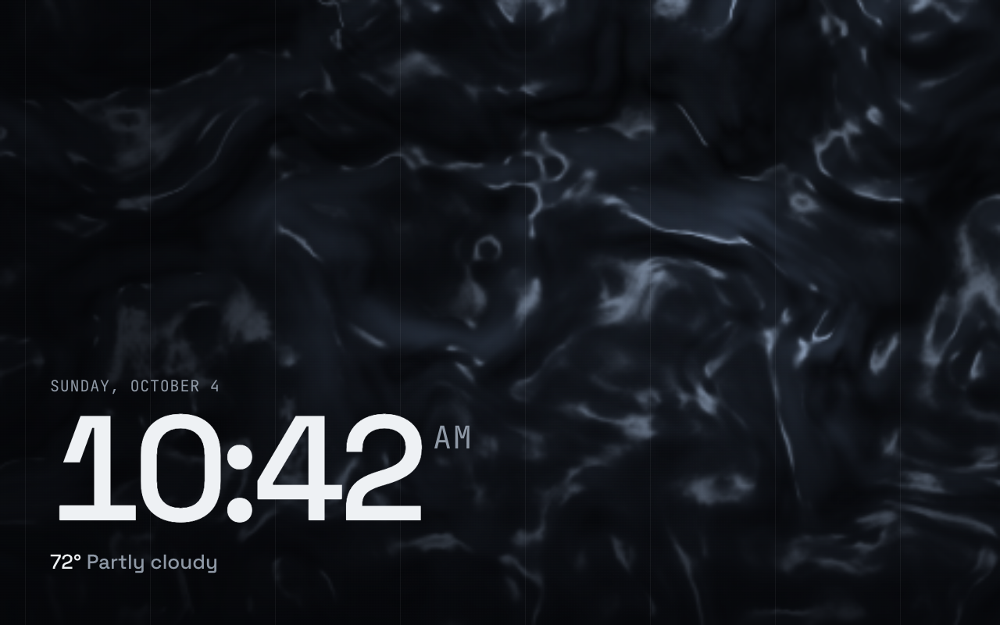

# Liquid



Dark liquid metal that slowly flows and folds over itself, catching thin silvery highlights, with a large
clock, the date and the weather in the lower left. Inspired by the liquid backgrounds on agency sites; the
shader is original.

Not a built-in screen: add it from the dashboard to use it.

- **Data refresh:** 60 seconds
- **Template:** [`screen.html`](screen.html)

## Data it uses

| Field | Shown as |
|---|---|
| `time.date`, `time.hhmm`, `time.ampm` | Date and clock |
| `weather.current.temperature`, `weather.current.condition` | Weather line |

The liquid doesn't use any data.

## Restyling

All colors, including the liquid's, are variables at the top of the `<style>` block:

```css
:root {
  --lq-ink: #eef1f4;    /* clock */
  --lq-muted: #8f99a6;  /* date, conditions */
  --lq-base: #06070a;   /* the liquid in shadow */
  --lq-sheen: #303b4a;  /* light across the folds */
  --lq-shine: #a9bad0;  /* bright highlights on the ridges */
}
```

Settings at the top of the script:

| Setting | Default | What it does |
|---|---|---|
| `RES` | `0.35` | Shader resolution as a share of 1280×800 (448×280), scaled up smoothly by the browser |
| `FRAME_SKIP` | `1` | `2` draws every other frame (about 28 fps) to halve the GPU load |
| `SPEED` | `0.05` | How fast it flows |
| `SCALE` | `1.0` | Size of the folds (smaller = bigger folds) |
| `BUMP` | `0.45` | How strongly the folds catch the light |
| `SHOW_FPS` | `false` | Frame rate readout, top right |

## Notes

- **Runs at the Echo Show 8's full refresh rate** (55.9 Hz, no dropped frames). An earlier version that
  computed the noise per pixel every frame ran at 4.5 fps on the Echo's Mali-T720, so this one bakes four
  channels of seamlessly tiling fractal noise into a 256×256 texture once at load (about 0.2 s on the Echo),
  then each frame warps and lights it with about six texture lookups per pixel.
- The flowing, folded shapes come from domain warping: one noise lookup shifts where the next one reads.
- A gradient over the lower left keeps the text readable; faint vertical rules sit on top.
- Needs WebGL. Without it the background stays the base color and the text still shows.
